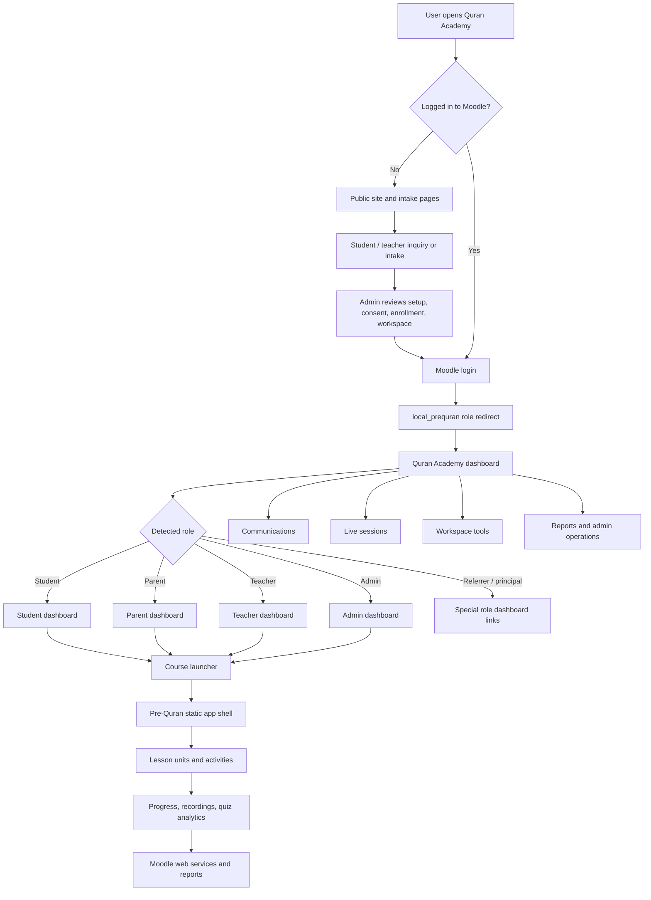
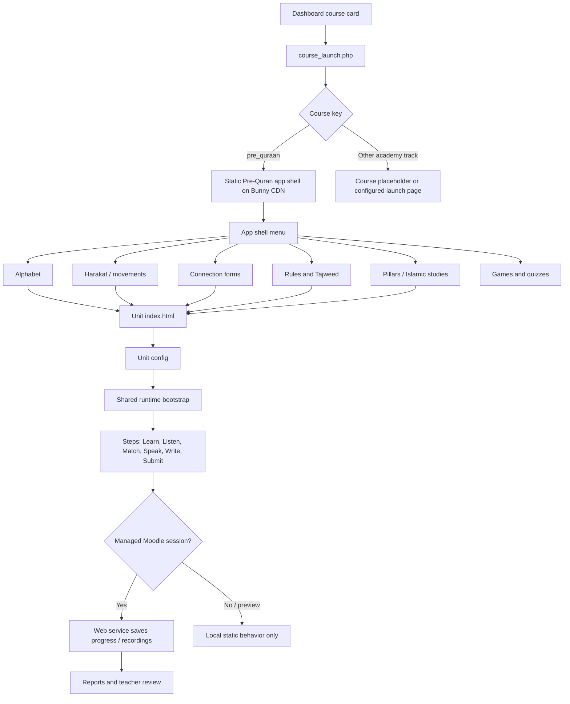
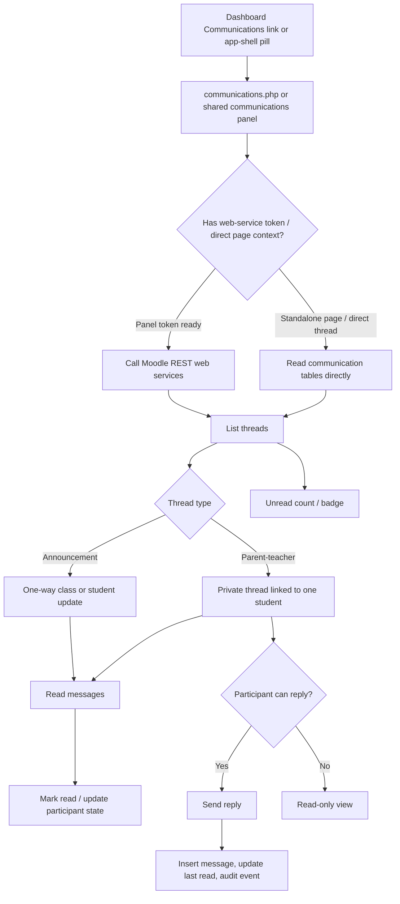
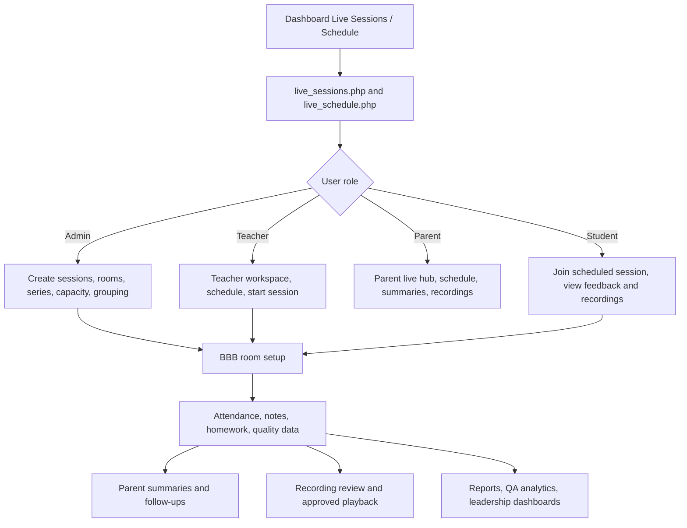
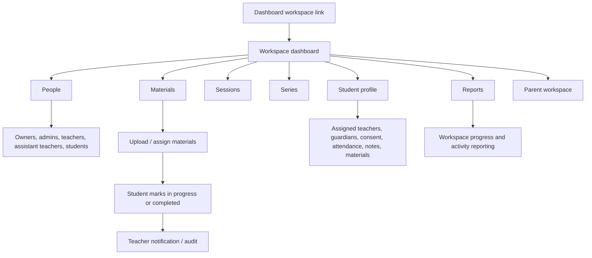
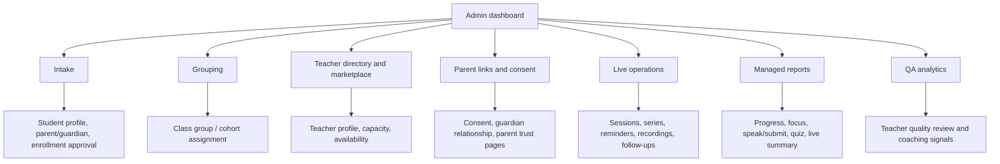

# Quran Academy App Flowchart For Testing

Purpose: help a new testing intern understand where users enter the system, which areas they can reach, and what to verify in each flow.

## Big Picture

Primary files to know:

- `src/moodle/local_prequran/lib.php` handles Moodle dashboard redirection into the Quran Academy hub.
- `src/moodle/local_hubredirect/dashboard.php` builds the role-aware dashboard.
- `src/moodle/local_hubredirect/course_launch.php` sends users into the course app.
- `src/moodle/local_hubredirect/issue_child.php` securely routes managed lesson links.
- `src/app-shell/index.html` and `src/app-shell/js/app-shell.js` run the static learner launcher.
- `src/shared/js/runtime/` and `src/shared/js/shared-*.js` power unit activities.
- `src/moodle/local_prequran/externallib_v4.php` contains the Moodle web-service backend.

## Role Dashboard Flow

```mermaid
flowchart TD
    A[Moodle /my or direct hub URL] --> B[Dashboard redirect]
    B --> C[Resolve role]

    C -->|Student account or managed student| S[Student dashboard]
    C -->|Guardian consent or communication participant| P[Parent dashboard]
    C -->|Assigned teacher, live teacher, or marketplace teacher| T[Teacher dashboard]
    C -->|Site admin| AD[Admin dashboard]
    C -->|Referrer / principal| SP[Special dashboard options]

    S --> S1[Courses]
    S --> S2[Live sessions and schedule]
    S --> S3[Workspace profile / materials]
    S --> S4[Communications]
    S --> S5[Teacher feedback and recordings]

    P --> P1[Child selector]
    P --> P2[Child courses]
    P --> P3[Parent live hub]
    P --> P4[Communications]
    P --> P5[Recordings, summaries, trust receipts]

    T --> T1[Student selector]
    T --> T2[Teacher workspace]
    T --> T3[Live sessions / schedule]
    T --> T4[Parent follow-ups]
    T --> T5[Communications]
    T --> T6[Marketplace profile]

    AD --> A1[Student intake and grouping]
    AD --> A2[Live admin menu]
    AD --> A3[Teacher directory and capacity]
    AD --> A4[Parent links and consent]
    AD --> A5[Managed reports and QA analytics]
    AD --> A6[SQL / deployment support tools]
```

Tester focus:

- Confirm each account type lands on the expected dashboard.
- Confirm users cannot open dashboard links for roles or students they are not allowed to access.
- For parent and teacher accounts, test the child/student selector before opening courses, communications, live sessions, and reports.

## Course And Lesson Flow

Tester focus:

- Open the app shell from the dashboard and verify the correct environment: production, staging, or integration.
- Verify each unit loads its grid, media, messages, and step state without console errors.
- For managed students, refresh after completing steps and confirm progress persists.
- Test Speak and Submit recording flows with permission prompts, upload success, and report visibility.
- Test quiz analytics by completing an attempt and checking the matching report page.

## Communications Flow

Safety model to test:

- Announcements are readable by targeted users but not replyable.
- Parent-teacher messages are scoped to one student.
- Parents can read and reply only where they are explicit participants or linked guardians.
- Teachers can access only assigned/cohort students.
- Students should not see parent-teacher threads.
- Normal users cannot hard-delete messages.
- Audit rows are created for communication actions when tables are available.

Important files:

- `src/shared/js/shared-communications-panel.js`
- `src/moodle/local_hubredirect/communications.php`
- `src/moodle/local_prequran/services.php`
- `src/moodle/local_prequran/externallib_v4.php`
- `src/moodle/local_prequran/sql/create_comm_phase1.sql`

## Live Session Flow

Tester focus:

- Verify join links appear only inside the allowed time window and for permitted participants.
- Confirm teacher, parent, student, and admin views expose different tools.
- Test post-class notes, homework, summaries, follow-ups, and recording approval from end to end.
- Verify parent-visible pages do not expose internal-only teacher/admin notes.

## Workspace Flow

Tester focus:

- Verify workspace members cannot view another workspace without permission.
- Confirm materials assigned to a student appear on that student's workspace profile.
- Confirm completion updates notify the correct teachers and do not notify unrelated users.

## Admin And Data Flow

Tester focus:

- Use admin tests to create or verify the data needed for role-based testing.
- After creating links or consent, log in as the affected parent/student/teacher and verify the front-end changes.
- Treat admin pages as setup plus evidence: most user-facing bugs should be confirmed from the role account, not only from admin.

## Intern Test Route

Use this route for a first end-to-end smoke test:

1. Log in as admin and verify the dashboard opens.
2. Confirm a test student has a parent/guardian, teacher assignment, consent, and course access.
3. Log in as the student and open the Pre-Quran course.
4. Complete one small lesson step, refresh, and confirm progress remains.
5. Complete or simulate one quiz/recording event and verify the report path.
6. Log in as the parent and confirm the same child appears in the selector.
7. Open Communications and verify announcements/messages are scoped to that child.
8. Log in as the teacher and verify the student appears in the teacher dashboard, reports, live tools, and communications.
9. Open a live session/schedule page for each role and verify role-specific actions.
10. Return to admin reports and confirm the activity is visible where expected.

## Regression Checklist

- No page-level PHP errors or Moodle exceptions.
- No browser console errors on app shell, unit pages, communications panel, and live-session pages.
- User role redirects are stable after logout/login.
- Student and child IDs are preserved in course, communication, report, and live-session links.
- Direct URLs reject unauthorized users.
- Static CDN app shell opens the expected environment.
- Moodle REST calls include a valid token and return JSON, not login HTML.
- Communications badges, thread lists, thread details, and replies agree with backend data.
- Live-session pages respect consent, join timing, recording approval, and parent visibility.
- Reports match the activity completed by the test account.
