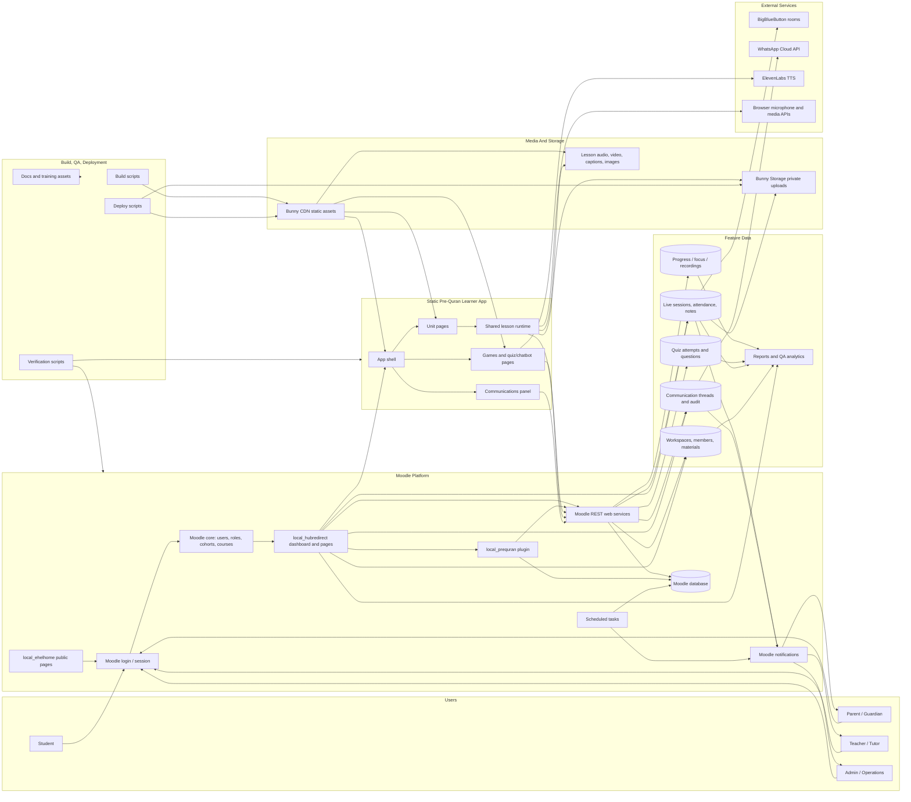

# Quran Academy System Components Diagram

Purpose: show the major system components and how they are linked for testing, onboarding, and release planning.

## Component Notes

- Users enter through Moodle login, public pages, or direct dashboard links.
- `local_hubredirect` is the main role-aware hub for dashboard pages, live tools, workspaces, communications, reports, and course launch.
- `local_prequran` owns most backend data, web services, scheduled tasks, notifications, and permission checks.
- The static learner app runs from Bunny CDN and calls Moodle REST services when launched with a managed student context.
- Unit pages share runtime modules for step state, playback, progress, speak/write/submit flows, media, and reporting.
- Communications connect the static app panel, standalone Moodle page, web services, communication tables, audit logs, Moodle notifications, and optional parent alerts.
- Live sessions connect dashboard pages, Moodle data, BigBlueButton rooms, attendance, notes, recordings, parent summaries, reports, and reminders.
- Workspace tools manage people, materials, sessions, series, reports, and student/parent views.
- Build and deploy scripts generate and publish static assets, then verification scripts smoke-test the resulting output.

## Testing Boundaries

- Frontend boundary: app shell, unit pages, communications panel, games, quiz, and media playback.
- Backend service boundary: Moodle REST calls for progress, recordings, quiz, communications, live sessions, and reports.
- Permission boundary: role redirects, student/child scoping, workspace membership, teacher assignment, guardian links, and direct URL denial.
- External-service boundary: Bunny CDN/storage, BigBlueButton, Moodle notifications, WhatsApp alerts, ElevenLabs, and browser microphone permissions.
